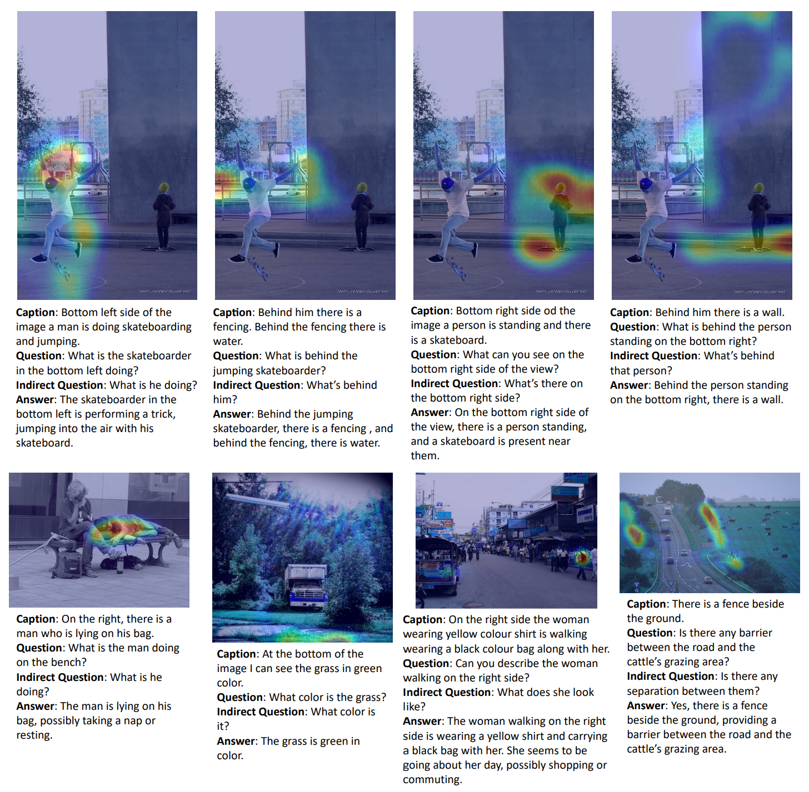
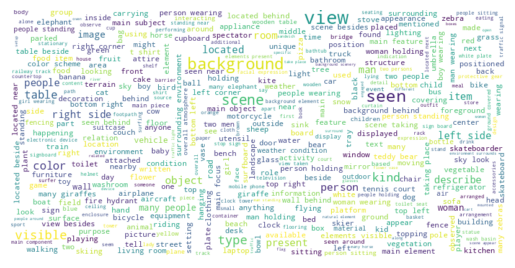
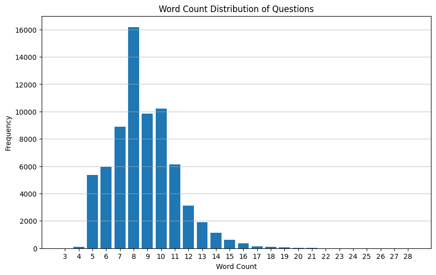
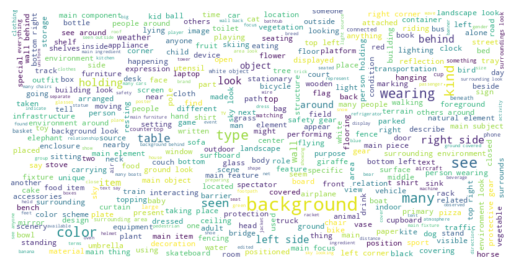
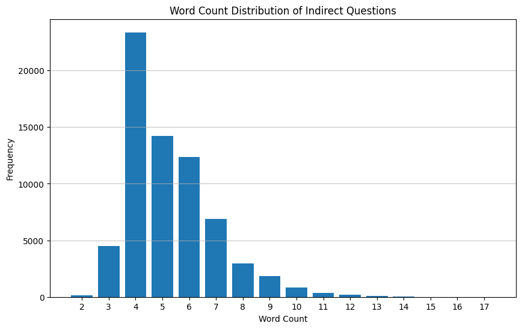
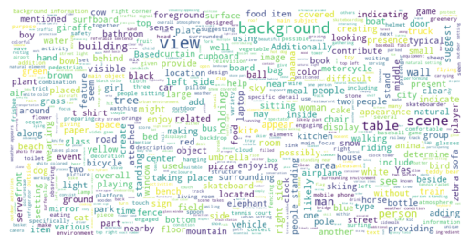
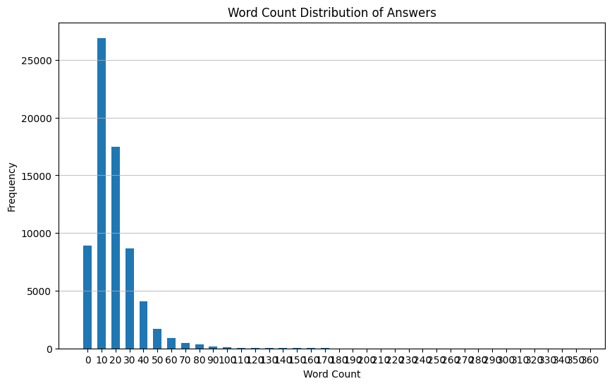
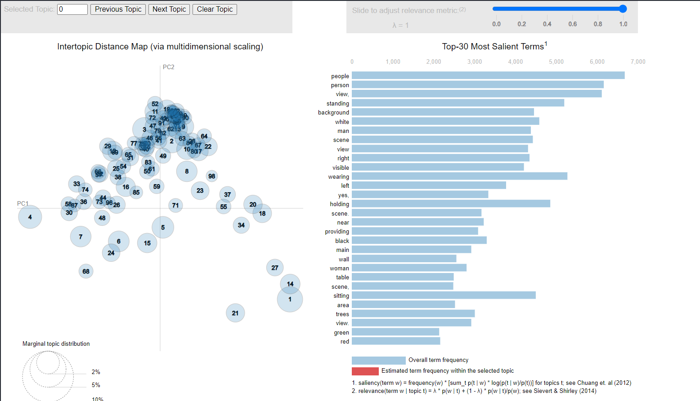

# Official Repository for **Voila-A: Aligning Vision-Language Models with User's Gaze Attention**

This is the official repository for the paper **"Voila-A: Aligning Vision-Language Models with User's Gaze Attention"**, published in *Advances in Neural Information Processing Systems (NeurIPS 2024)*. The paper introduces the **Voila-COCO** dataset, a novel resource designed to align vision-language models with user gaze attention, enabling more human-like interactions in multimodal tasks.

You can access the paper on arXiv:  
👉 **[Voila-A: Aligning Vision-Language Models with User's Gaze Attention](https://arxiv.org/abs/2401.09454)**

---

## Roadmap and Open-Source Status
We are committed to open-sourcing all components of this project. Below is the current roadmap checklist:

- [x] **Dataset Release**: The **Voila-COCO** dataset is now available for download.
- [ ] **Model Code Release**: The implementation of the Voila-A model is currently being refactored and will be released soon.
- [ ] **Training Scripts**: Scripts for training and fine-tuning the model will be provided.

Stay tuned for updates!

---

## Table of Contents
1. [Dataset Overview](#dataset-overview)
2. [Download Dataset](#download-dataset)
3. [File Structure](#file-structure)
4. [Dataset Sample](#get-dataset-sample)
5. [Diversity and Quality Analysis](#voila-coco-diversity-and-quality)
6. [Customization](#customize)
7. [Citation](#citation)

---

## Dataset Overview
The **Voila-COCO** dataset provides annotations, images, and metadata for exploring vision-language alignment tasks. It includes traces, corresponding question-answer (QA) pairs, and other relevant information.



You can access the dataset files and utilize them for your research.

---

## Download Dataset
The dataset is hosted on Hugging Face. You can download it directly from the following link:

👉 **[Download Voila-COCO Dataset](https://huggingface.co/datasets/skywang/VOILA-COCO)**

Please follow the instructions on the Hugging Face page to download and set up the dataset for your use.

---

## File Structure
Once downloaded, the dataset is organized as follows:
```
.
|-- README.md                     # This file
|-- voila_anno.json               # Annotation file containing traces and corresponding QA pairs
|-- voila_image.json              # Compressed image data
|-- voila_meta.json               # Meta index of conversations
`-- voilagaze_dataset.py           # Torch dataset implementation for quick data leveraging
```

---

## Get Dataset Sample
To quickly get a sample from the dataset, you can directly run `voilagaze_dataset.py`. The output will be structured as follows:

```python
example = {
    "id": instruction_id,          # Unique identifier for the instruction
    "source": src_item,            # Source item (e.g., text or image reference)
    "text_mask": src_item_mask,    # Mask for the source text
    "patch_images": patch_images,  # Patched image data
    "trace_heatmap": trace_heatmap,# Heatmap of user gaze traces
    "trace_tokens": trace_tokens,  # Tokens representing the trace
    "trace_mask": trace_mask,      # Mask for the trace tokens
    "trace_box": trace_box         # Bounding box coordinates for the trace
}
```

---

## Voila COCO Diversity and Quality
We provide an analysis of the diversity and quality of the dataset, including visualizations and statistical insights. The source code for generating these analyses can be found at: [statistic.ipynb](src/dataset/statistic.ipynb).

### Questions
#### Wordcloud


#### Length Distribution


### Indirect Questions
#### Wordcloud


#### Length Distribution


### Answers
#### Wordcloud


#### Length Distribution


#### LDA Topic Model Distribution


---

## Customize
Feel free to modify our code to suit your specific research needs. If you encounter any issues or have questions, please contact us at: **kunyan@buaa.edu.cn**.

---

## Citation
If you find our dataset useful for your research, please kindly cite the following paper:

```bibtex
@article{yan2024voila,
    title={Voila-A: Aligning Vision-Language Models with User's Gaze Attention},
    author={Yan, Kun and Wang, Zeyu and Ji, Lei and Wang, Yuntao and Duan, Nan and Ma, Shuai},
    journal={Advances in Neural Information Processing Systems},
    volume={37},
    pages={1890--1918},
    year={2024}
}
```

---

## Acknowledgments
We thank all contributors and collaborators who helped in the creation and curation of this dataset. Your feedback and contributions are highly appreciated!

---

For more information, please refer to the provided links or contact the authors directly. Happy researching! 🚀